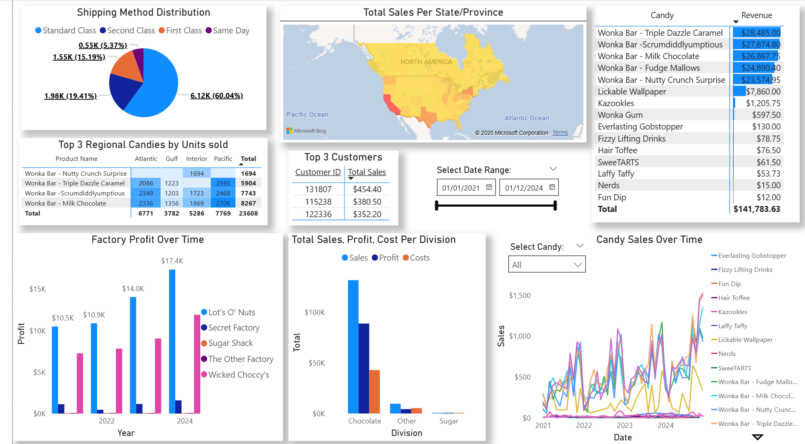

# 📊 Candy Distributor Data Analyst Project

An end-to-end data analytics project project using Python, SQL, and Power BI to analyze and visualize sales and profit data for a candy distributor. The goal is to determine the trends of the candy products, the factories, and regional data to help make informed business decisions for the future to maximize profit and minimize resource expenditure.

---

## 🎯 Project Objectives

- Import CSV into PostgreSQL with Python to create tables
- Perform data cleaning, transformation, and analysis using SQL
- Build interactive dashboards using Power BI for stakeholder insights
  
---

## 🧰 Tools & Technologies

- **Python** (pandas, sqlalchemy): Importing CSV files directly into PostgreSQL tables
- **SQL** (PostgreSQL): Data cleaning, transformation, and querying
- **Power BI**: Creating visualisations and interactive data dashboards
---

## 🗃️ Data Sources

Dataset: [US Candy Distributor Dataset – Maven Analytics](https://mavenanalytics.io/data-playground?order=date_added%2Cdesc&tags=Business)  
Includes:

- `Candy_Sales.csv`: Sales transactions by region, order date, sales, cost, units sold, and product ID  
- `Candy_Products.csv`: Product attributes like product name, product ID, factory, price, and cost

---

## ❓Questions to Answer

- What are the best selling candies?
- What factories are the most profitable?
- Who are the top 3 customers by sales?
- What are the top 3 candies per region?
- What are the top states/provinces by sales?
- What candy type generates the most revenue?
- What is the percentage that each shipping method is used?
- What is the overall trend of factory profit?
- What is the trend of candy sales?

---

## ⚙️ How to Run the Project
1. Download [requirements.txt](requirements.txt), and the files in [`data`](data/)
2. Install the Python libraries: -`pip install -r requirements.txt`
3. Create a CandyDb database in PostgreSQL
4. Run [`import_csv_postgresql.py`](python/import_csv_postgresql.py) in Python to directly import the CSV files into tables in CandyDB
5. Run the -[`CandyQueries.sql`](sql/CandyQueries.sql) queries in PostgreSQL to transform, clean, create views, and query the data
6. Run [`CandyBI.pbix`](powerbi/CandyBI.pbix) in PowerBI to create visualisations and an interactive dashboard

---

## 🔍 Results/Findings
- The best selling candies are the Chocolate Bars, particularly the Triple Dazzle Caramel, Scrumdiddlyumptious, and Milk Chocolate. 
- The Lot's O' Nuts factory is the most profitable, but Wicked Choccy's is a close second.
- The top 3 customers are 131807, 115238, and 122336.
- The top 3 candies per region are all the same as the best selling, except for the Interior region, which replaces Scrumdiddlyumptious with Nutty Crunch Surprise.
- The states with the most sales are California, New York, and Texas.
- Chocolate is the highest revenue candy division by a substantial margin.
- Standard shipping accounts for about 60% of shipping, second and first class are between 15%-20%, and same day is around 5%
- Overall for the top factories and chocolate the profit and sales are increasing year over year. However, for the other factories and candies, their growth appears stagnant. Their sales are only marginally higher. 
- Their is an overall quarterly trend showing increasing sales as the year progresses.

---

## 💡 Recommendations
- Due to the extreme difference in revenue from chocolate compared to sweets and the other category I would suggest either reducing or eliminating production of non-chocolate candies.
- Furthermore, the factories producing sweets and other candies are producing little profit. Therefore, adding chocolate manufacturing to these factories would be beneficial to increase chocolate production. 
- Another option is to close the Sugar Shack and The Other Factory and open new chocolate factories in the top selling states of California, New york, or Texas where the demand is high.
- It is important to ramp up candy production throughout the year to prepare for the quarterly increase in sales.
- Second and first class are close in shipping percentage. Perhaps lowering the cost of second class would increase customer use and increasing first class cost would lower customer use while maintaining a similar revenue.

---
## 📌 Future Improvements

- Data on the factory costs including equipment, materials, salaries would allows further evaluation of factory optimization and profitability
- Data on the identified top customers would allows marketing campaigns targeting customers with similar preferences lead to higher conversion rates on advertisements
---

## 📬 Contact
Lorenzo Gardiner
 
🌐 [LinkedIn](www.linkedin.com/in/lorenzo-gardiner)
